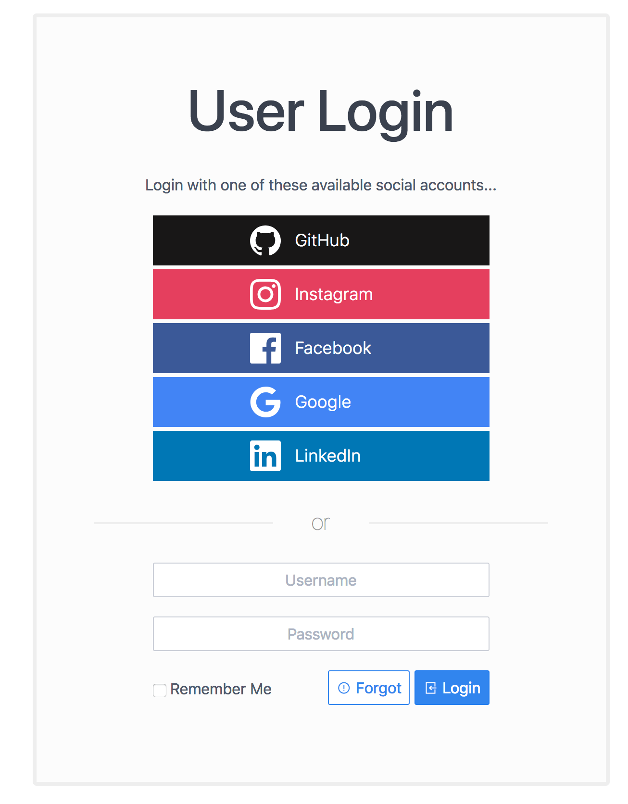

# Oauth Login 
Vamos a utilizar express, mongo y passport.js

`regístrate: signup`
`inicia sesión : login`

- Oauth : Estandar para la autenticación, es una forma de abordar la autenticación de un usuario en tu aplicación 
- Permite a los usuarios `iniciar sesion`en tu aplicación utilizando `third-party services` como facebook, google, github.
- Cuando observamos una aplicación con los botones de google, facebook, github, puedes deducir que están utilizando OAuth2
para autenticar usuarios.

- Cuando le damos click a uno de esos botones en un aplicación web, nos registramos en la aplicación e iniciamos sesión dentro de la aplicación utilizando una cuenta de red social

## Beneficios
- Una cosa menos por la que nos tenemos que preocupar.
- A nivel de usuario, no tienen que llenar un formulario para que se registren en nuestra aplicación.
- No tienen diferentes cuentas que recordar
- Identificación centralizada online que puedes usar para registrarte e iniciar sesión en cualquier aplicación