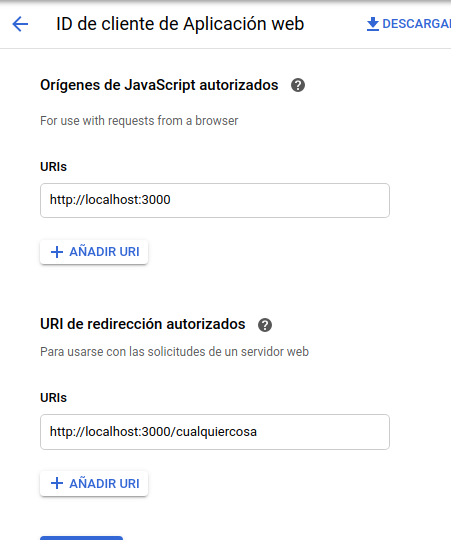
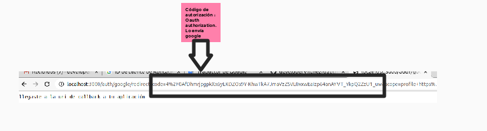
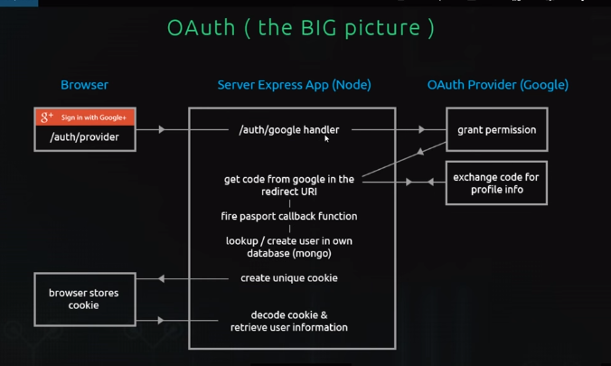
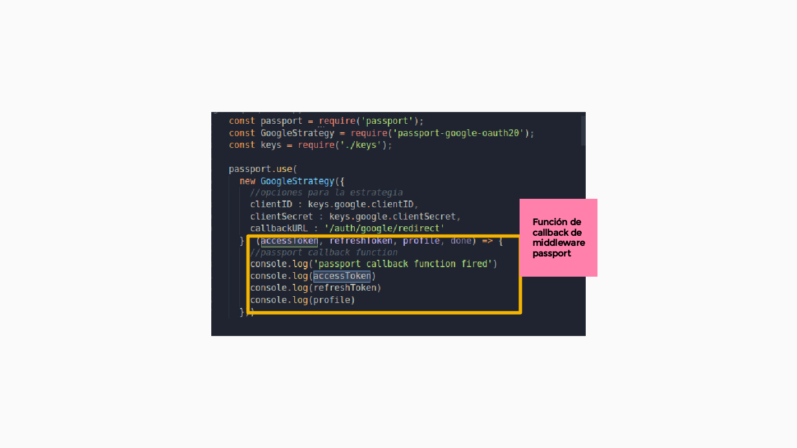
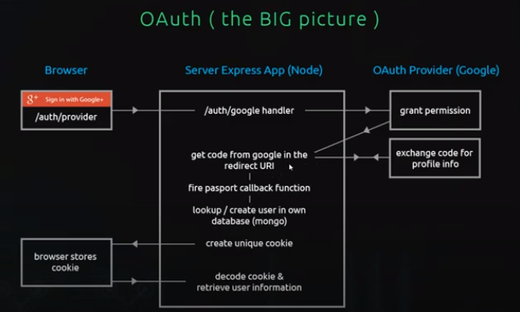

# app - express

1.- Inicializando la aplicación express

2.- Agregamos las rutas de OUath, agregamos la vista de loging

3.- Para manejar el flujo de oauth vamos a utilizar passport,
`passport` es un middleware de autenticación para `node js` Utiliza estrategias para soportar diferentes formas de autenticación. Tenemos que instalar la librería y la estrategia
`strategies` son las diferentes maneras que podemos inciar sesión utilizado servicios de terceros

4.- Vamos a utilizar google+ api para autenticar a los usuarios con sus credenciales de google 

- [passport-strategy-google](http://www.passportjs.org/packages/passport-google-oauth20/)

- [vas a la consola de google developers](console.developers.google.com)

1.- Creas el proyecto `ninja-oauth-test`
2.- Vas a la biblioteca e indicas que api vas a utilizar `google+`
3.- Vas a la pantalla de consentimiento ingresas los datos que te pide
4.- Vas a la pestaña credenciales y generas la estrategia en cómo van a generar un lazo de confianza tu aplicación y el servidor de google. De este paso tendrás

```md
- `ID de cliente` : xxxxxxx

- `Secreto de cliente` : xxxxxxxx

- `Uris (para usar con solicitudes de un navegador)` : http://localhost:3000 

- `Uri de redirección autorizada (para utilizarse con las solicitudes de un servidor web) ` : http://localhost:3000/cualquiercosa 

```
5.- Vamos asegurar las credenciales utilizando un archivo keys el cual lo colocaremos en el archivo gitignore para que no se publique en github. Recuerda que estos valores los adquieres al crear tu proyecto y las credenciales respecticas en `console.developers.google`


6.- Vamos a entender el tema de las URI al momento de hablar del estandar abierto para la autenticación OAuth



Tienes que definir 2:

a) Para utilizar con solicitud desde un navegador. Es el URI de origin de la aplicación cliente.

b) `Uri de redirección autorizada`, es para utilizar con la solicitud de un servidor web. Esta es la ruta de tu aplicación a la que se dirige al usuario después que se ha autenticado con google, a esta ruta se le agregará el `codigo de autorización`,
ese código representa, que el usuario autoriza la petición de tu aplicación a google en su nombre.



7.- Prueba que todo funcione `npm run start`. Ahora analizamos el flujo de oauth para la web.

    7.1 damos click en el boton de `inicia sesión con google +`
    7.2 para que haga algo gestionamos esa ruta en nuestra app de node. Le decimos que nos envíe a la pantalla de autenticación de google
    7.3 Ingresamos nuestras credenciales o indicamos con que cuenta queremos trabajar
    7.4 Google utiliza nuestra uti de redirección y nos envvía el código de autorización con el que el usuario nos dice que autoriza el proceso de atorgamiento de token
    7.5 Pasamos el **middleware de passport** en la ruta de redirección donde google nos agregó el código de autorización. El middleware de passport se encarga de gestionar con google el token y los datos del profile que nos los traerá en su función de callback






8.- Creamos la base de datos en mongo y lo conectamos con nuestra aplicacion.

9.- Creamos el modelo user con mongoose

10.- Usamos la data del profile que nos provee el middleware `passport` y l guardamos en nuestra base de datos. Aspi mismo se ha cambiado el puerto a 5001

11.- En este proceso vamos a recuperar usuarios, es decir, verificar que si ya existe en la base de datos no se vuelva a crear

12.- Proceso para repasar lo que se ha avanzando, asociar el esquema con el código y entender lo que se viene implementando y hacia donde queremos ir.




13.- Lo que hicimos en esta rama fue el serializar y deserializar el id de un usuario que está guardada en nuestra base de datos.
Serializar : información que voy a enviar al navegador a través de una cookie
deserializar : información que voy a decodificar de la cookie que venga del navegador

14.- En la sesión galletas creamos la cookie que enviaremos al navegador y que cuando el usuario se logee regresará a nosotros en el objeto request.user
`npm run start`